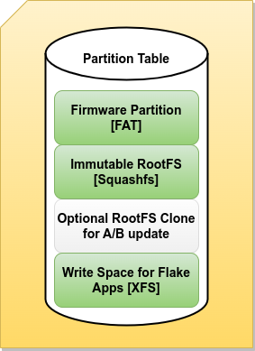

# EOS - Embedded OS

1. [Introduction](#introduction)
2. [OS and AppStore Projects](#projects)
3. [Boot EOS](#boot)
   1. [EOS on AWS](#aws)
   2. [EOS in KVM](#kvm)
   3. [EOS on RaspberryPI](#rpi)
6. [Run A container workload on EOS](#container)
7. [Run A VM workload on EOS](#firecracker)
8. [Changing Flake Registry](#flakeregistry)
9. [Setup Update Server](#updateserver)
   1. [Update an EOS instance](#update)

## Introduction <a name="introduction"/>

EOS is an OS design for embedded use cases. Workloads on EOS are
expected to run as container or VM instances. The OS is fully
immutable, except for the firmware partition. The following
diagram shows the main disk layout:



It is not expected
that someone works with the system like with a classical server.
This means if the OS has to change, this change needs to be
performed in the OS project which builds the image, then tested
and then published to an EOS update server. Any instance of EOS
can then decide to fetch the update via the ```os-update```
tool. The update uses the A/B partition concept and is applied via
kexec including a commit to indicate success. A reboot after commit
can be performed optionally. The procedure is comparable to the
way a mobile phone runs updates.

Any platform that supports kexec + grub|u-boot can be supported

## OS and AppStore Projects <a name="projects"/>

The value of EOS comes with the projects that builds it. The OS image
as well as the update server are build using the Open Build Service
connected to this git repo. Please find the EOS project here:

* https://build.opensuse.org/project/show/home:marcus.schaefer:EOS

Running applications on EOS are expected to be provided as containers
or VMs. An example registry for container based apps and firecracker
compatible VM images can be found here:

* https://build.opensuse.org/project/show/home:marcus.schaefer:delta_containers

## Boot EOS <a name="boot"/>

EOS is currently provided on the following target platforms:

* As AMI in the AWS public cloud
* As KVM virtual disk image for testing in QEMU/VMware, etc...
* As RaspberryPI disk image for testing on the PIv4/PIv5

### EOS on AWS <a name="aws"/>

The EOS AMI is not yet published and lives in a private AWS account.
On interest please reach out for sharing the AMI ID with any
given account.

### EOS in KVM <a name="kvm"/>

To run EOS in qemu-kvm fetch the following data and call the run script:

```bash
mkdir binaries
pushd binaries
wget https://download.opensuse.org/repositories/home:/marcus.schaefer:/EOS/images_ALP/EOS.x86_64-AB.raw.xz
popd
wget https://raw.githubusercontent.com/OSInside/eos/main/eos/run
chmod u+x run
./run
```

### EOS on RaspberryPI <a name="rpi"/>

To run EOS on a RaspberryPI an SD card or USB storage disk is required.
Connect the SD card or the USB stick to a workstation.
The following procedure assumes the SD card or stick device appears
as ```/dev/sdx```.

**_NOTE:_** Dumping data to the wrong device can seriously harm
the workstation and the data stored on it. You have been warned !

```bash
wget https://download.opensuse.org/repositories/home:/marcus.schaefer:/EOS/images_ALP/EOS.aarch64-RPI.raw.xz
xz -d EOS.aarch64-RPI.raw.xz
dd if=EOS.aarch64-RPI.raw.xz of=/dev/sdx status=progress
```

Next put the SD card or stick to the RaspberryPI and boot up.

**_NOTE:_** There is no graphics system configured on EOS. Thus only
console messages will appear. Serial console access is therefore helpful,
at best via a TTL2USB switch. The direct rendering interface ```/dev/dri```
will be available to run a graphical compositor (e.g weston) in a
privileged container to run graphical workloads. An example image build
named ```suse-AGL``` that implements a graphical workload based on the
EOS design can be found in the following project:

* https://build.opensuse.org/package/show/home:marcus.schaefer:AGEDA

## Run A container workload on EOS <a name="container"/>

EOS has been setup to provide a split OCI container registry. One part of the
registry lives in the read-only area of EOS itself. In this area EOS provides a
pre-populated ```basesystem``` container. The other part of the registry
points to a fully writable and encrypted partition. This area is used to
register and manage container instances. The read-write part of the container
registry can also consume the pre-registered read-only basesystem container.
Managing containers is done via ```podman``` which is part of EOS. Using other
container management systems like k3s is possible but needs adaptions to
the EOS image description.

Along with podman to run and handle container instances in a workload
there is also another software called ```flake-pilot``` which orchestrates
the container instances prior launching and registers a containerized
application as an application binary which can be managed under the control
of systemd. Such an application is called a ```flake```. More about flakes
here:

* https://github.com/OSInside/flake-pilot

The AppStore project of EOS hosts OCI container images which are created
to be used as flakes. Some of the containers there are built as delta
containers, which means they require a basesystem to function. The
advantage here, the delta containers providing the applications are very
small. As an example there is the ```lynx``` console web browser available
as a flake. To use it run the following flake registration:

```bash
flake-ctl podman register --container suse-apps/lynx --target /usr/bin/lynx --app /usr/share/flakes/bin/lynx --base basesystem
```

Once done, the system now has a new command named ```lynx``` and it
can be called like a normal application as follows:

```
lynx
```

The launch indicator gives a hint that this is not a normal application
but a container workload.

## Run A VM workload on EOS <a name="firecracker"/>

EOS comes with ```firecracker``` which is a software by Amazon that
allows to run virtual machine images through KVM. This means for VM
workloads it's required that the machine EOS runs on supports KVM
virtualization.

Similar to containers ```flake-pilot``` also supports VM
orchestration through the firecracker backend. Registration and startup
of a VM workload can be done as follows:

```bash
flake-ctl firecracker pull --name leap --kis-image https://download.opensuse.org/repositories/home:/marcus.schaefer:/delta_containers/images_leap/firecracker-basesystem.$(uname -m).tar.xz
flake-ctl firecracker register --vm leap --app /usr/share/flakes/bin/mybash --target /bin/bash --overlay-size 20GiB
```

Once done, the system now has a new command named ```mybash``` and it
can be called like a normal application as follows:

```
mybash --version
```

The launch indicator gives a hint that this is not a normal application
but a VM workload

## Changing Flake Registry <a name="flakeregistry"/>

On EOS the only place to write anything is the flake registry.
Everything else is read-only on a filesystem that does not
implement write(). The target device for this registry can be
setup and activated through the ```flake-registry``` command.
Setup a new registry can be done as follows:

```
flake-registry --setup /dev/storage/device
```

**_NOTE:_** The given device will be wiped !

Activating a device setup as a flake registry can be done as
follows:

```
flake-registry --activate /dev/storage/device
```

## Setup Update Server <a name="updateserver"/>

The EOS update server is built as an image as part of the EOS project here:

* https://build.opensuse.org/package/show/home:marcus.schaefer:EOS/eos-update

The EOS update server can update any A/B based system that follows the
disk layout of EOS. Thus it is not limited to EOS but it requires the
disk layout of EOS. As of today the update server image builds as AWS
AMI only. The reason for this is because the concept of this update
process perfectly fits into the cloud world. There can be multiple instances
of update servers around the globe with connectivity as well as bandwidth
and storage resources controlled by the cloud system.

The EOS update server AMI is not yet published and lives in a private
AWS account. On interest please reach out for sharing the AMI ID with any
given account.

Setup the server requires the following steps:

1. Launch an instance of the EOS Update Server AMI
1. Edit the file ```/etc/os-update.yml``` and setup the image URL and
   local image name to fetch an EOS like system. There
   are entries of the form:

    ```yaml
    ---
    update:
      -
        image: https://download.opensuse.org/repositories/home:/marcus.schaefer:/EOS/images_ALP/EOS.aarch64-RPI.raw.xz
        name: EOS.aarch64-RPI-ALP.raw
      -
        image: https://download.opensuse.org/repositories/home:/marcus.schaefer:/EOS/images_TW/EOS.aarch64-RPI.raw.xz
        name: EOS.aarch64-RPI-TW.raw
    ```
1. Call the os fetcher service

    ```bash
    systemctl start os-fetch
    ```

   This will call a one-shot service which fetches all the images
   referenced in ```/etc/os-update.yml``` and starts the actual
   ```os-update-daemon@.timer``` services. After the fetcher is done,
   the status of the individual update images can be watched as follows:

    ```bash
    systemctl status os-update-daemon@EOS.aarch64-RPI-TW.timer
    ```

   The service will lookup periodically for changes of the image
   at the origin image URL. If the image has changed it will be
   fetched again. For setting up different lookup times the file
   ```/usr/lib/systemd/system/os-update-daemon@.timer``` needs to
   be changed accordingly
1. Enable SSH based access to the update images
   Edit the file ```~/.ssh/authorized_keys``` and add an entry of the form:

    ```bash
    command="/usr/bin/os-update-restricted.sh" KEY...
    ```

   The value for ```KEY...``` is the public key of the respective private
   key that is placed in the ```fleet``` container pre-installed to the
   EOS like image. The os-update-restricted.sh command makes sure that only
   an os-update process is allowed with this key and nothing else.
   
For a closer look to the EOS update server, it helps to watch
the contents of ```/srv/www/fleet/os-images```. In this directory
all update images are hosted and loop-setup'ed such that only their
OS root device can be streamed through the network. For the above
example this looks like the following:

```bash
/srv/www/fleet/os-images/
├── EOS.aarch64-RPI-TW.raw
├── EOS.aarch64-RPI-TW.raw.dev -> /dev/loop5p3
├── EOS.aarch64-RPI-TW.raw.sha
```

### Update an EOS instance <a name="update"/>

For update of the main OS, a tool called ```os-update``` exists.
os-update uses ```/etc/os-update.yml``` to get it's information about
updates. There is an update server instance running on AWS to provide
a public facing update server connected to the OBS project mentioned
in [OS and AppStore Projects](#projects)

Any instance of EOS can contact this server for updates of the main OS.

**_NOTE:_** The OS update process is based on the mentioned A/B
partition based concept and intentionally only covers the main OS
which excludes any data on the write partition that stores the user
data, e.g the container registry or the firecracker repository

As EOS is a fully immutable OS, the check for an update is based on a simple
checksum between the actual image on the update server and the current root
device of the running system.

**_NOTE:_** To access the update server a key is required. This
credentials information is provided in a pre-installed container
named ```fleet``` and must be protected for real production systems.
Along with the container a flake application of the same name is
provided.

To check for updates call:

```bash
fleet --getkey
os-update --check
```

To apply an OS update call:

```bash
os-update --apply
```

The update process will fetch the root OS partition and dump it in either
A or B. After that the system gets activated through kexec. The kexec boot
will commit the new system as the last systemd service in the chain. At
this point we expect the system update to be successful. Only after commit
the system has effectively changed the root partition device to
either A or B. In case of any issue prior commit, no damage to the system
has happened because no change was effectively committed. If the kexec turns
the system into a dead loop or bricks it a power cycle needs to be issued
to return the machine into a good state again. If, after all, the system
committed the update but the update is not ok for some other
reason, a rollback can be issued as follows:

```bash
os-update --rollback
reboot
```
